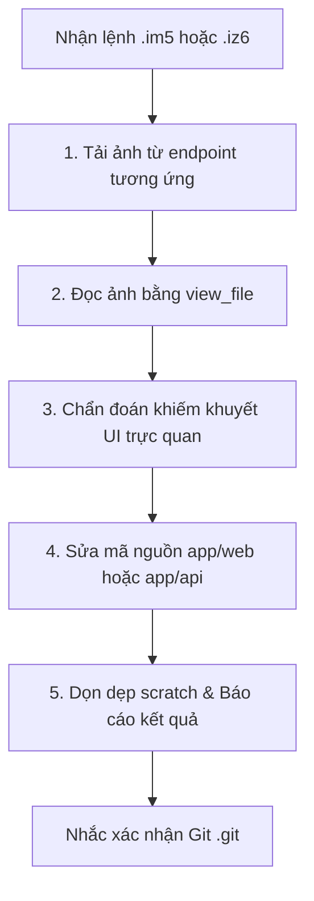

# QLN UI Bug Fixer (.im5 / .iz6)

Skill chuyên dụng tự động hóa quy trình tiếp nhận ảnh chụp màn hình lỗi giao diện từ các thiết bị của người học thông qua các endpoint chia sẻ ảnh cục bộ, phân tích trực quan khiếm khuyết UI và trực tiếp sửa mã nguồn.

---

## 1. Kích hoạt lệnh `.im5` và `.iz6`

| Lệnh | Thiết bị mục tiêu | Endpoint ảnh chụp màn hình |
| :--- | :--- | :--- |
| **`.im5`** | Thiết bị `m55` | `http://m55:8080/latest` |
| **`.iz6`** | Thiết bị `zf6` | `http://zf6:8080/latest` |

Khi người học gửi tin nhắn `.im5` hoặc `.iz6` (hoặc yêu cầu fix bug qua ảnh từ `m55:8080` / `zf6:8080`):
1. **Không coi là từ vựng tiếng Anh**: Tuyệt đối không giải nghĩa từ vựng, không chấm điểm câu trả lời hay thay đổi trạng thái bài học.
2. **Kích hoạt quy trình 5 bước** dưới đây hoàn toàn tự động và liền mạch.
3. **Tuân thủ quy ước dấu câu (Punctuation Protocol)**: Nếu tin nhắn kết thúc bằng dấu `?` (ví dụ: `.iz6 giao dien hoi roi?`), chỉ thực hiện bước 1, 2, 3 (tải ảnh, xem ảnh, chẩn đoán/thảo luận) và bước 5 (dọn dẹp ảnh tạm), **TUYỆT ĐỐI KHÔNG** thực hiện bước 4 (sửa mã nguồn).

---

## 2. Quy trình 5 bước xử lý lỗi (Visual Bug Fix Workflow)



### Bước 1: Thu thập ảnh mới nhất (Fetch Screenshot)
* Xác định endpoint theo lệnh:
  * `.im5` ➔ `http://m55:8080/latest`
  * `.iz6` ➔ `http://zf6:8080/latest`
* Chạy lệnh tải ảnh từ máy chủ ảnh nội bộ về thư mục scratch của phiên làm việc:
  ```bash
  curl -sI <ENDPOINT_URL> && curl -sL <ENDPOINT_URL> -o "<artifact_dir>/scratch/latest_bug.jpg"
  ```
* Ghi nhận các trường metadata:
  * `X-Image-Filename`: Tên file gốc (ví dụ: `SmartSelect_20260919_130222_Chrome.jpg`, `AISelect_20260919_121532_Chrome.jpg`).
  * `X-Image-Modtime` / `Last-Modified`: Thời gian chụp ảnh.

### Bước 2: Quan sát trực quan bằng công cụ `view_file`
* Gọi công cụ `view_file` trỏ tới đường dẫn file ảnh vừa tải về trong `scratch/`.
* Xem xét toàn bộ màn hình hoặc chi tiết vùng bị lỗi được người dùng đánh dấu hoặc khoanh vùng.

### Bước 3: Chẩn đoán nguyên nhân cốt lõi (Diagnose Root Cause)
* **Lỗi vỡ layout (FOUC / Unstyled)**:
  * Do bộ đệm trình duyệt (Cache/Service Worker) giữ CSS/JS cũ.
  * Do thứ tự đặt thẻ DOM chưa hợp lý (đặt overlay/drawer ở luồng tài liệu thông thường thay vì cuối body).
  * Do thiếu Critical CSS nhúng sẵn trong `<head>`.
* **Lỗi tràn màn hình / co giãn**:
  * Kiểm tra viewport meta, safe-area padding (`env(safe-area-inset-*)`).
  * Kiểm tra flexbox, `overflow-y: auto`, `box-sizing: border-box`.
* **Lỗi tương tác / hiển thị động, Deep Linking & Cử chỉ**:
  * Kiểm tra logic JavaScript trong `app/web/app.js` và các module trong `app/web/modules/` (selector DOM, event listeners, class toggle).
  * Kiểm tra URL Hash Routing: Mọi modal/popup (Cài đặt `#settings`, `#settings/ai`, `#settings/voice`, Vault `#vault`) phải đồng bộ URL hash khi đóng/mở/chuyển tab, mở lại đúng view khi F5/refresh, và đóng lại an toàn khi nhấn phím Back của Android/trình duyệt (`hashchange`).
  * Kiểm tra Cử chỉ Mobile & Pull-to-Refresh: Xác nhận các scroll container chính (Chat, Modal Cài đặt, Drawer, Vault) đều hỗ trợ kéo xuống để làm mới khi ở đỉnh (`scrollTop <= 0`), không chặn cuộn thông thường, có phản hồi rung haptic và spinner xoay.

### Bước 4: Sửa mã nguồn & Xác thực (Patch & Verify)
* Chỉnh sửa các file liên quan bằng `replace_file_content`:
  * Giao diện HTML: `app/web/index.html`
  * Bảng kiểu CSS: `app/web/style.css`
  * Kịch bản JS: `app/web/app.js` hoặc các module trong `app/web/modules/`
  * Bộ đệm Service Worker: `app/web/sw.js` (luôn tăng phiên bản cache `CACHE_NAME`)
  * Máy chủ Go: `app/api/main.go`
* Nếu có chỉnh sửa backend Go:
  * Biên dịch lại bằng `bash app/build.sh`.
  * Khởi động lại tiến trình server nền bằng `setsid -f /data/data/com.termux/files/home/.local/bin/english-server ... > /dev/null 2>&1`.
* Xác thực cú pháp (ví dụ `node -c app/web/app.js`).

### Bước 5: Dọn dẹp & Báo cáo (Cleanup & Report)
* Xóa file ảnh tạm trong thư mục scratch để giải phóng bộ nhớ.
* Báo cáo súc tích:
  1. **Ảnh đã đọc**: Tên ảnh, thiết bị (`m55` hoặc `zf6`) và thời gian chụp.
  2. **Khiếm khuyết phát hiện**: Mô tả ngắn gọn lỗi trực quan thấy được trong ảnh.
  3. **Giải pháp đã thực hiện**: Tóm tắt các file đã sửa đổi và cơ chế khắc phục.
* **Luôn kết thúc bằng câu hỏi xác nhận Git**:
  ```text
  [CONFIRM] Bạn có muốn commit và push các thay đổi này lên Git bằng lệnh .git không?
  ```
